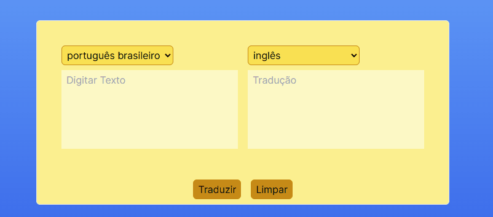

    

    Tradutor 🌻 <a href="https://tradutor-viniciusgabriel.vercel.app/" alt="link do site" target="_blank">
    Acesse o site aqui</a>    

## Sobre

Um tradutor que trabalha em 5 línguas diferentes: português brasileiro, inglês, francês, espanhol e italiano. Para que isso seja possível, ele utiliza da [MyMemory API](https://mymemory.translated.net/doc/spec.php).

    

## Tecnologias

- [Next.js](https://nextjs.org/)
- [React.js](https://react.dev/)
- [TypeScript](https://www.typescriptlang.org/)
- [Tailwind](https://tailwindcss.com/)